# codeCV with AI

**AI-powered Resume Builder SaaS Platform**

---

## 🧠 Problem Statement

Traditional resume building is time-consuming and frustrating. Job seekers struggle to:
- Create visually appealing and tailored resumes.
- Generate unique, compelling content for every application.

**codeCV with AI** aims to solve this by automating resume content generation using AI, providing an intuitive UI, and offering customizable templates to streamline the process.

---

## 💡 Solution

We developed a **SaaS web application** leveraging modern web technologies and AI to:
- Automatically generate personalized resume content.
- Offer user-friendly forms and resume templates.
- Simplify resume creation, editing, sharing, and downloading.

---

## 🌐 What is SaaS?

**SaaS (Software as a Service)** delivers software over the internet—no installations needed. Users access the platform via their browsers. Examples: Gmail, Dropbox, Google Docs.

---

## 🧱 Technical Overview

### 🏗️ System Architecture

The project follows a **client-server architecture** with three main layers:

1. **Frontend** – ReactJS + Vite
2. **Backend** – Strapi CMS + Clerk Auth
3. **Database** – MySQL

### ⚙️ Frontend (Port: 5173)

Built with **ReactJS** and **Vite** for a fast, modern development experience.

#### Features:
- Homepage (Intro + CTA)
- Sign-in/Sign-up with Google, GitHub, or Email
- Dashboard (Manage & Create Resumes)
- Edit Resume (Forms + Resume Content)
- View & Download Resume (PDF & Share options)

#### Why React?
- Component-based architecture
- Virtual DOM for performance
- Community support and flexibility

#### Why Vite?
- Lightning-fast hot reload (HMR)
- Native ES Module support
- Better dev experience with optimized builds

---

### 🛠️ Backend (Port: 3306)

Uses **Strapi CMS** for content management and API creation, and **Clerk** for authentication.

#### Features:
- Resume CRUD operations
- Auth via Clerk (Signup/Login)
- Gemini API integration for AI content generation

#### Why Strapi?
- Auto-generates RESTful APIs
- Customizable content types
- Built-in admin panel

#### Why Clerk?
- Easy and secure user auth
- Email + Social login support
- Backend-as-a-Service (BaaS)

---

### 🗃️ Database – MySQL (Relational)

Stores structured resume data like:
- Personal info
- Education
- Experience
- Skills

#### Why SQL?
- Structured schema
- Powerful querying
- Data integrity and scalability

---

## 🔗 API Design

| Endpoint | Method | Description |
|----------|--------|-------------|
| `/user-resumes` | POST | Create new resume |
| `/user-resumes?filters[userEmail][$eq]={userEmail}` | GET | Get resumes by email |
| `/user-resumes/:id` | GET | Get resume by ID |
| `/user-resumes/:id` | DELETE | Delete resume by ID |

---

## 🚀 Deployment

- **Frontend** hosted on [Vercel](https://vercel.com/)
- **Backend** deployed on [Render](https://render.com/)

---

## 🖼️ Screenshots

> 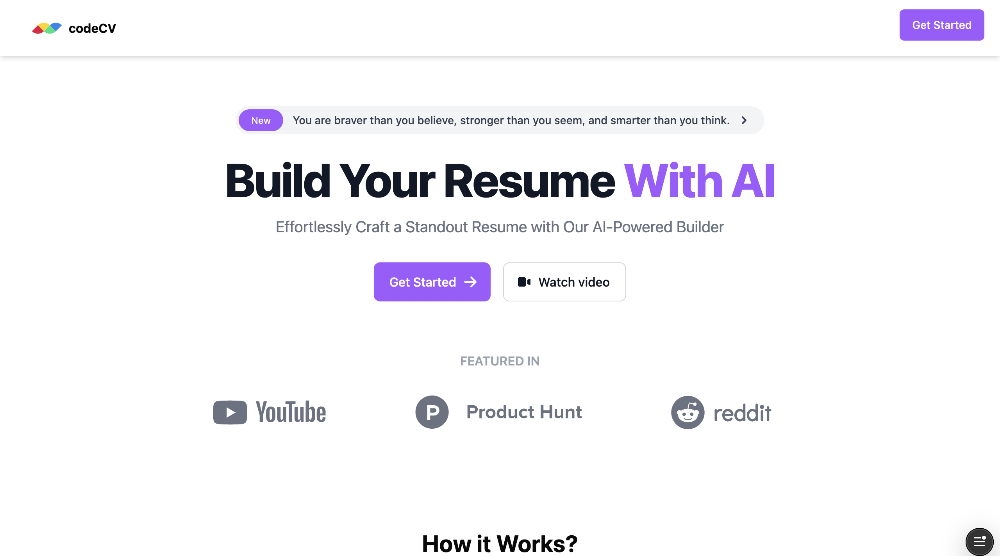
> 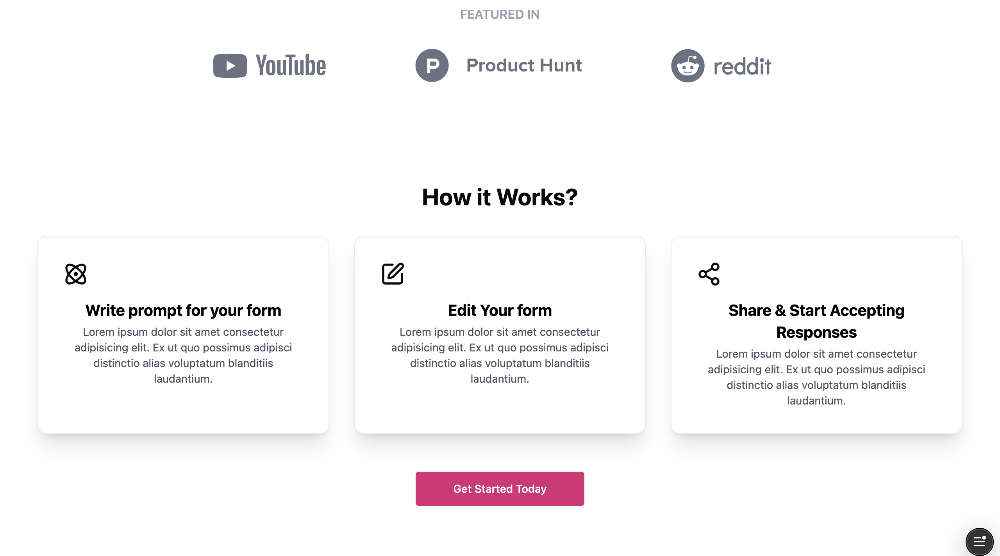
> 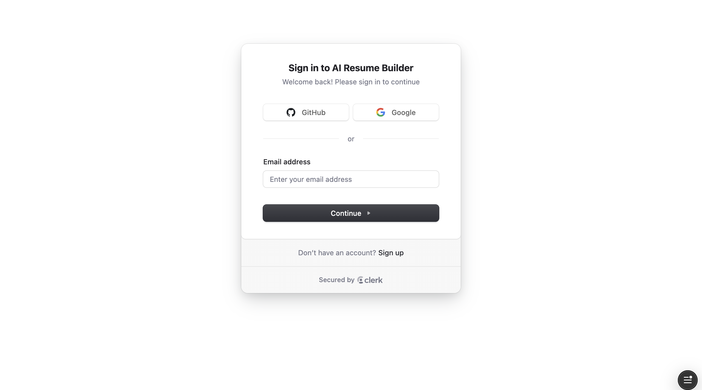
> 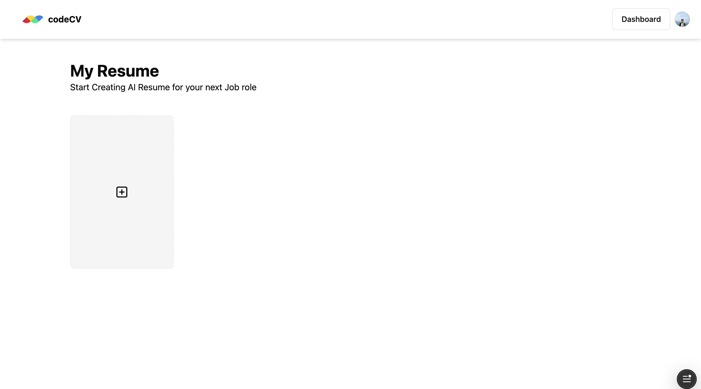
> 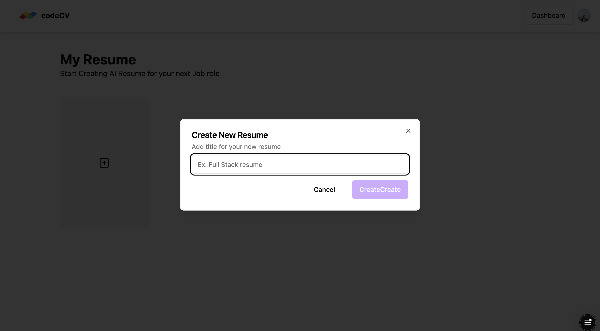
> 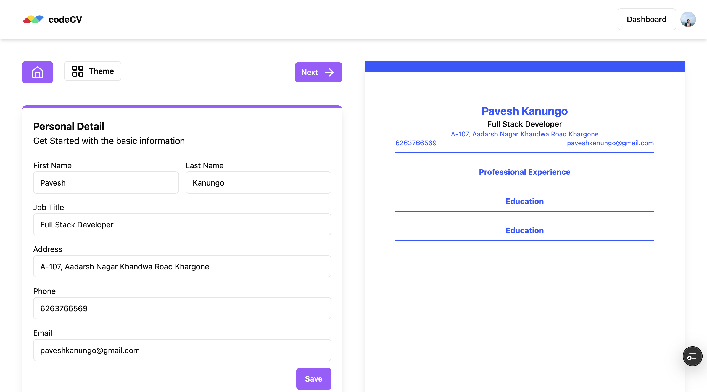
> 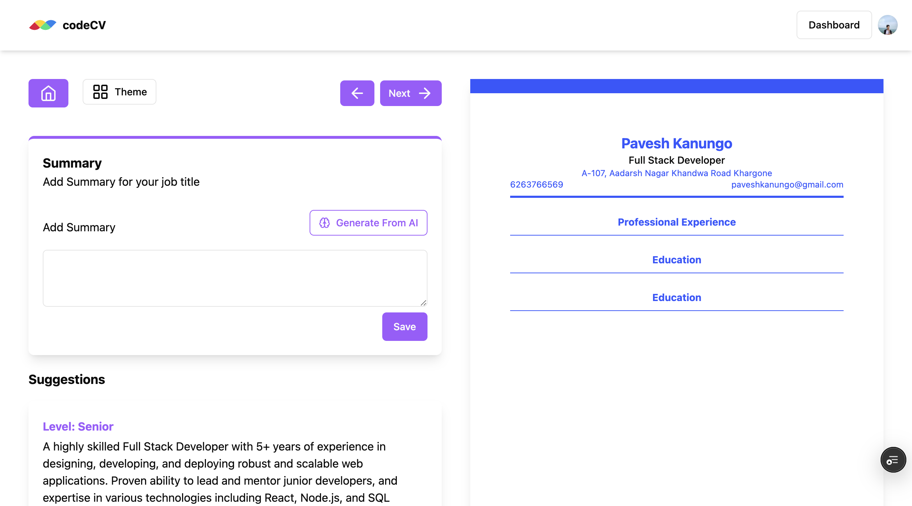
> 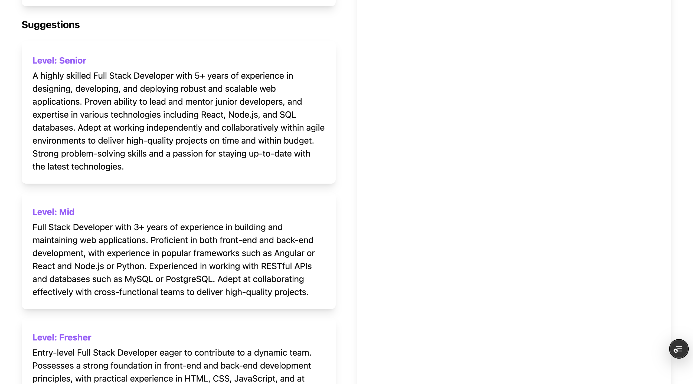
> 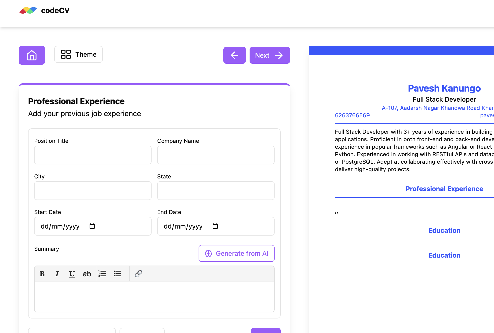
> 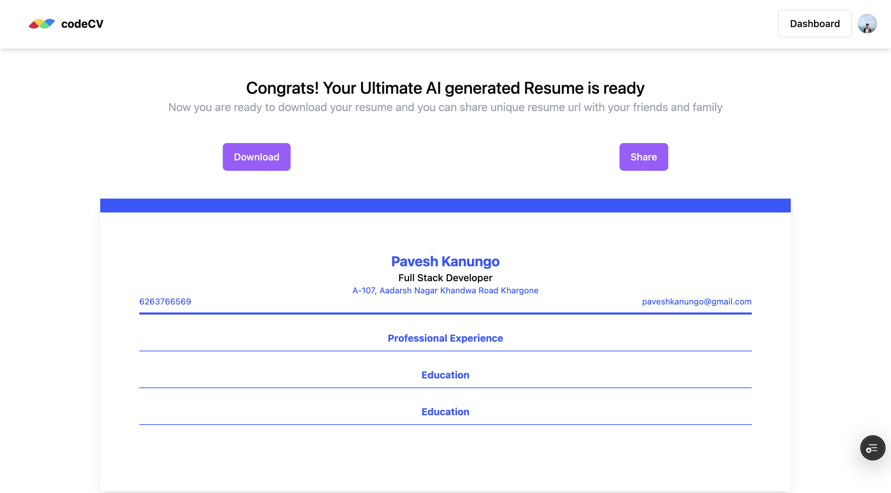
> 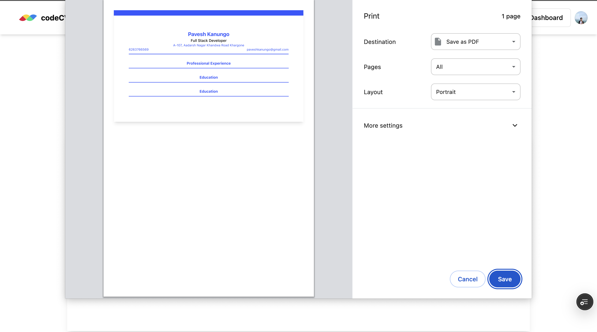 

---

## 🔐 Environment Variables

To run this project locally, you need to set up environment variables:

### 📁 Root `.env` file

```env
# Server
HOST=
PORT=

# Secrets
APP_KEYS=
API_TOKEN_SALT=
ADMIN_JWT_SECRET=
TRANSFER_TOKEN_SALT=

# Database
DATABASE_CLIENT=
DATABASE_HOST=
DATABASE_PORT=
DATABASE_NAME=
DATABASE_USERNAME=
DATABASE_PASSWORD=
DATABASE_SSL=
JWT_SECRET=
```

---

# 🚀 Getting started with Strapi

Strapi comes with a full featured [Command Line Interface](https://docs.strapi.io/dev-docs/cli) (CLI) which lets you scaffold and manage your project in seconds.

---

### `develop`

Start your Strapi application with autoReload enabled. [Learn more](https://docs.strapi.io/dev-docs/cli#strapi-develop)

```
npm run develop
# or
yarn develop
```

### `start`

Start your Strapi application with autoReload disabled. [Learn more](https://docs.strapi.io/dev-docs/cli#strapi-start)

```
npm run start
# or
yarn start
```

### `build`

Build your admin panel. [Learn more](https://docs.strapi.io/dev-docs/cli#strapi-build)

```
npm run build
# or
yarn build
```

---

## ⚙️ Deployment

Strapi gives you many possible deployment options for your project including [Strapi Cloud](https://cloud.strapi.io). Browse the [deployment section of the documentation](https://docs.strapi.io/dev-docs/deployment) to find the best solution for your use case.

---

## 📚 Learn more

- [Resource center](https://strapi.io/resource-center) - Strapi resource center.
- [Strapi documentation](https://docs.strapi.io) - Official Strapi documentation.
- [Strapi tutorials](https://strapi.io/tutorials) - List of tutorials made by the core team and the community.
- [Strapi blog](https://strapi.io/blog) - Official Strapi blog containing articles made by the Strapi team and the community.
- [Changelog](https://strapi.io/changelog) - Find out about the Strapi product updates, new features and general improvements.

---

## ✨ Community

- [Discord](https://discord.strapi.io) - Come chat with the Strapi community including the core team.
- [Forum](https://forum.strapi.io/) - Place to discuss, ask questions and find answers, show your Strapi project and get feedback or just talk with other Community members.
- [Awesome Strapi](https://github.com/strapi/awesome-strapi) - A curated list of awesome things related to Strapi.

---